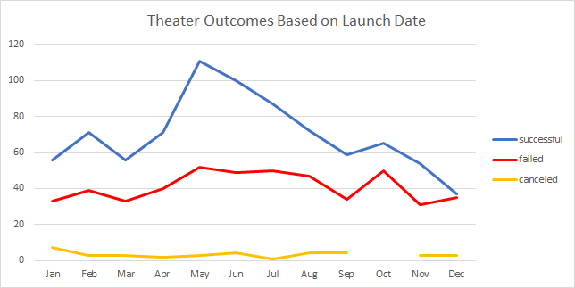
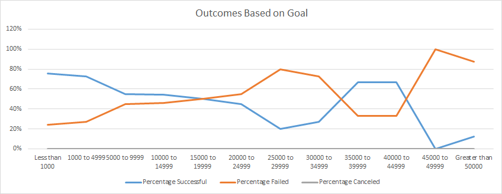

# Challenge 1 - Kickstarter Analysis Based on Launch Date and Funding Goal

## Project Overview

The purpose of this project is to analyze the outcomes of kickstarter campaigns based on campaign launch date and funding goal.

To perform this analysis, I focused on "theater" campaigns only.  Campaigns also had to be completed as either successful, failed, or canceled.  I then analyzed each of those outcomes to identify any trends based on launch date and campaign goal.

## Analysis and Challenges

### Analysis of Outcomes Based on Launch Date

Using the Kickstarter database, a summary table was created listing campaign outcomes based on the month in which their campaigns were launched.  Although an analysis could have been done by individual years, for this report we looked at all months collectively across years.

### Analysis of Outcomes Based on Goals

For this analysis, a summary table was created to break fundraising goals into ranges.  Then the percent of campaigns that were successful, failed, or canceled within each goal range was calculated.

### Challenges and Difficulties Encountered

One of the challenges was working with such a large set of data, of which we were only using a limited subset.  Care had to be taken to make sure there were no unexpected filters still set from previous analysis done on this dataset.

## Results

- Based on my analysis, campaigns that were launched in May/June looked to be the most successful, whereas campaigns launched in the winter looked to be the least successful.

- The number of campaigns that either failed or were canceled seemed to be pretty consistent across all months.

- For the outcomes based on fundraising goals analysis, while it looks looks like the campaigns with the lowest goals were most successful and those with the highest goals were least successful, everything in between those two ranges went back and forth between successful and failed.  Based on this report, there does not seem to be a clear association between campaign goal amount and outcome.

- In trying to analyze the connection between launch month and outcome, another possible table or graph that could be created would be to look at outcomes as a percentage of total campaigns by month.  Doing this could reinforce whether or not campaign successes were indeed driven by the month in which they were launched, and not just a result of more campaigns being launched in those months.

- One of the limitations of this dataset is that we only have information on campaigns through the year 2017.  Any new trends that may have developed in the last few years would not be represented.

